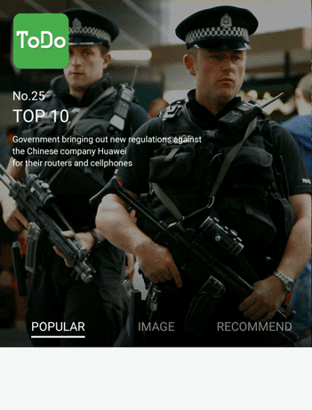

# DecentBanner

To try out the sample, download the apk from [http://chengdazhi.com/decentbanner](chengdazhi.com/decentbanner) or scan the following QR code:

## Features

* Smooth buoy movement animation and title opacity animation.

* You can choose to enable logo at the top left corner.

* Compatible to banners with less than three items.

* You can specify the auto scroll interval and animation duration.

* public methods to start and stop auto scroll.

* Infinite loop.

## Import

Maven

    <dependency>
      <groupId>it.chengdazhi.decentbanner</groupId>
      <artifactId>decentbanner</artifactId>
      <version>1.0.3</version>
      <type>pom</type>
    </dependency>

Gradle

    dependencies {
        compile 'it.chengdazhi.decentbanner:decentbanner:1.0.5'
    }

## Usage

* To initiate your DecentBanner, first acquire DecentBanner instance mDecentBanner in Java or XML, then:

        /**
        * @param views the list of views that you want to include in the banner
        * @param titles the list of titles that appears as tabs at the bottom
        * @param intervalSeconds the interval of auto scrolling, set to 2 in sample
        * @param animationMillis the scrolling's animation time, set to 500 in sample
        * @param int logoResourceId | Bitmap logoBitmap the logo you want to display.
                You can skip this param if you don't want it.
        */
        mDecentBanner.start(List<View> views, List<String> titles, int intervalSeconds,
                int animationMillis[, int logoResourceId | Bitmap logoBitmap]);

* Note that when you want to show less than 3 views, you need to extend the views to be no less than three items. When you want to display 2 views, your titles param should contain 2 items and your views param should contain 4 items as ABAB

* You can call the following two methods to start/stop auto scrolling.

        mDecentBanner.startAutoPlay();
        mDecentBanner.stopAutoPlay();

## License

    Copyright 2016 chengdazhi

    Licensed under the Apache License, Version 2.0 (the "License");
    you may not use this file except in compliance with the License.
    You may obtain a copy of the License at

       http://www.apache.org/licenses/LICENSE-2.0

    Unless required by applicable law or agreed to in writing, software
    distributed under the License is distributed on an "AS IS" BASIS,
    WITHOUT WARRANTIES OR CONDITIONS OF ANY KIND, either express or implied.
    See the License for the specific language governing permissions and
    limitations under the License.
